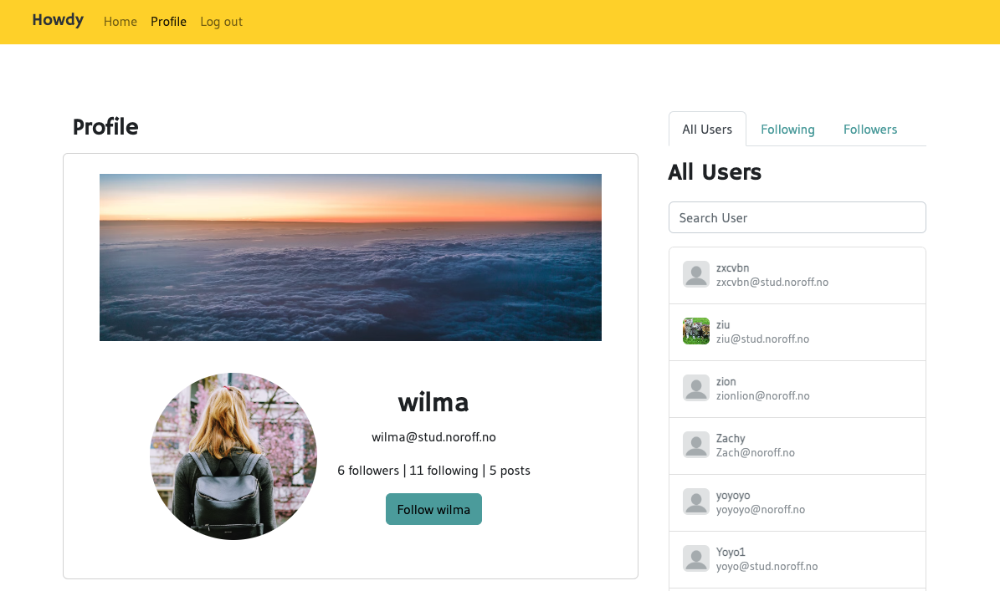

# Social-Media-Howdy

Demo site: https://social.kimuramegumi.site/



## Description

A functioning user interface that allows for viewing, posting, editing and deleting social media content.

## Built with

- HTML
- CSS
- SASS
- JS
- Bootstrap
- Noroff API.

## Getting Started

### Installing

1. Clone the repo:

```bash
git clone https://github.com/MegumiKim/Social-Media-Howdy.git
```

2. Install the dependencies:

```
npm i
```

### Running

To run the app, run the following commands:

```bash
npm run start
```

## Contributing

Please report bugs or send feedbacks for future improvement.

## Contact

[email] kimuramegumi@gmail.com

[LinkedIn] https://www.linkedin.com/in/kimuramegumi/
